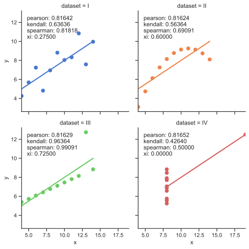
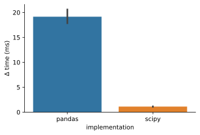

# Summary
## Python implementation of `xicor`

Tie-breaking in correlation computation is a challenging problem.
Given two vectors $X$ and $Y$, if multiple pairs of values at positions $i$ and $j$ are equal, e.g. $X_i = Y_i$ and $X_j = Y_j$, how can these values affect the correlation? Tie-breaking is especially challenging for computing correlations in sparse data, where the majority of the values are zero. Thus, there is a high chance that many of the $X_i = Y_i = 0$ pairs are equal. Within the Python ecosystem, the widely used Pearson correlation ([`scipy.stats.pearsonr`](https://docs.scipy.org/doc/scipy/reference/generated/scipy.stats.pearsonr.html?highlight=pearsonr#scipy.stats.pearsonr) doesn't account for ties as it is an exact calculation on the $X$ and $Y$ values. The commonly used Spearman correlation ([`scipy.stats.spearmanr`](https://docs.scipy.org/doc/scipy/reference/generated/scipy.stats.spearmanr.html#scipy.stats.spearmanr)  coefficient, which converts the values to ranks, deal with ties by assigning them the same rank or value. Only the Kendall Tau ($tau$) correlation [`scipy.stats.kendalltau`](https://docs.scipy.org/doc/scipy/reference/generated/scipy.stats.kendalltau.html) can account for ties separately in the $tau_b$ version. The $tau_b$ version accounts for ties by computing the total number of ties in $X$ and $Y$, and are excluded from the correlation coeffieent.

Xi ($Xi$) is a novel coefficient of correlation introduced by @chatterjee2020new. In this coefficient, ties are broken *randomly*, which allows for a more robust calculation of correlation. Below is Anscombe's quartet from @Anscombe1973-mv, a dataset of four pairs of $X$ and $Y$ values designed to have nearly the same linear summary statistics. For each dataset, four different coefficients of correlation are shown: (1) Pearson, (2) Spearman, (3) Kendall, and (4) Xi ($Xi$). Dataset IV is a particularly striking example of the Xi metric, as $Xi = 0$ due to the large number of ties, whereas the other correlation metric values are larger. Thus, the Xi metric is very useful to distinguish between spurious correlations in largely sparse data with many zeros or ties.

This implementation is based on the [R implementation](https://statweb.stanford.edu/~souravc/xi.R) linked in the paper. Our initial implementation used [pandas](https://pandas.pydata.org/) to perform the rank computation necessary to compute $Xi$, however we found this to be slow. Instead, we used [scipy](https://www.scipy.org/) to compute ranks and [numpy](https://numpy.org/) to compute mean and standard deviation, get ordered indices, and random sampling. This resulted in a 10-20x speedup, as shown below.

# Acknowledgements

We acknowledge funding from Chan Zuckerberg Biohub this project.

# References